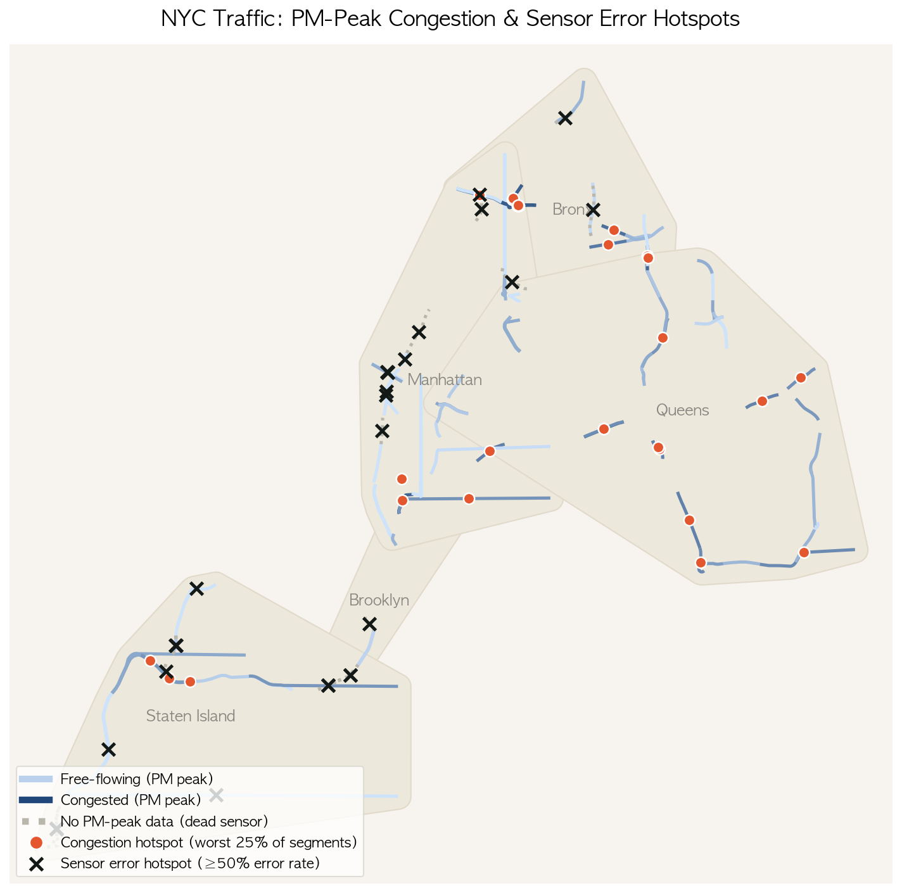

# NYC Traffic Data Analysis

*PM-peak congestion (color, free-flowing → congested) and sensor error hotspots (×, ≥50% error rate) across the 125-segment monitored network. Run: `python congestion_error_map.py`*

## 1. Sensor Reliability

Data: NYC DOT Traffic Speeds NBE (Socrata `i4gi-tjb9`), 2024-04-01 to 2024-08-01 (4 months), 4,233,169 rows

Sensor reliability = (total rows − rows with `status == -101`) / total rows

### Overall reliability

| Total rows | status=-101 count | Reliability |
|---|---|---|
| 4,233,169 | 1,056,062 | 0.7505 (75.05%) |

### Reliability by borough

| borough | total | error_count | error_rate | reliability |
|---|---|---|---|---|
| Manhattan | 904,947 | 395,470 | 0.4370 | 56.3% |
| Brooklyn | 370,312 | 140,285 | 0.3788 | 62.1% |
| Staten Island | 871,438 | 304,459 | 0.3494 | 65.1% |
| Bronx | 798,345 | 130,361 | 0.1633 | 83.7% |
| Queens | 1,288,127 | 85,487 | 0.0664 | 93.4% |

Queens is the most reliable, Manhattan the least — a 6.6x gap. Chart: `borough_reliability.png`

### Problem segments by borough

Top 5 error-rate segments per borough, excluding segments with fewer than 100 samples (noise).

- In Manhattan, Brooklyn, Staten Island, and Bronx, most top segments sit at **error_rate = 1.0** (zero valid readings across all 4 months — fully dead sensors), whereas **all of Queens's top 5 are below 100%** (19–33%) — no fully dead sensors, only partial instability. This matches why Queens has the highest overall reliability.
- Examples of fully dead segments: `VNB` (Verrazzano-Narrows Bridge), `MDE` (Major Deegan Expwy), `WSE` (West Shore Expwy), `SIE` (Staten Island Expwy), `Westside Hwy`, `Lincoln Tunnel`

Chart: `borough_problem_roads.png` (small multiples by borough)

Run: `python sensor_analysis.py`

### Does congestion cause sensor failure?

Hypothesis: segments on famously congested corridors (GWB approach, Lincoln Tunnel, West Side Highway/9A) fail more because heavy traffic wears down the sensors.

Tested on the two partially-dead Manhattan segments that still have some valid readings (Lincoln Tunnel W center tube: 94.11% error, 12th Ave S 57th–45th: 93.9% error).

**Lincoln Tunnel W center tube (id 329)** — 34,614 total rows, 2,039 valid (5.89%):
- Valid-reading speed: mean 17.19 mph, median 16.15 mph (range 1.2–39.8 mph) — genuinely low, consistent with congestion in the readings that do exist.
- But error rate *by hour* is lowest during rush hours (8–10am: 72–84%, 5–6pm: 86–92%) and highest overnight (1–5am, 8–11pm: ~100%) — the opposite of what the congestion hypothesis predicts. If congestion wore sensors down, error rate should peak with congestion, not drop.

**12th Ave S 57th–45th (id 106)** — mean valid speed 26.68 mph (less severe), and only a mild day/night error-rate difference (89–92% daytime vs 97–99% overnight), no clear rush-hour pattern.

**Conclusion: rejected.** The data doesn't support "congestion breaks sensors." What it does show is that valid-data availability varies by time of day per segment — for Lincoln Tunnel specifically, it's concentrated in rush hours, which conveniently overlaps with the hours we actually want to forecast. Each segment's usable time window needs to be checked individually rather than assumed uniform.

## 2. Data Processing

Functions in `soobin/cleaning/preprocess.py`.

1. **`drop_duplicate_ids`** — drops `link_id`, `transcom_id`, `encoded_poly_line`, `encoded_poly_line_lvls` (unused/redundant columns, see feature review above).
2. **`remove_dead_segments`** — drops segments where `status == -101` for every single row (never once reported a valid reading). These can't be interpolated — there's no real observation anywhere in the series to anchor an estimate to. Result: **16 segments, 487,811 rows removed**.
3. **`fill_missing_speed` / `fill_missing_travel_time`** — for the remaining segments, `status == -101` rows are set to NaN and filled with `interpolate(method="time")` per segment, falling back to `ffill`/`bfill` for edges interpolation can't reach.

| | speed | travel_time |
|---|---|---|
| Missing before | 396,112 | 396,077 |
| Missing after | 0 | 0 |

Final row count: 4,233,169 → **3,745,358** after dead-segment removal.

**Note:** interpolation only fills `speed`/`travel_time` — it never touches `status`. So the Section 1 reliability numbers must always be computed from the raw data, not from this processed output; recomputing reliability after `remove_dead_segments` would look artificially higher only because the worst-offending rows were already removed from the denominator, not because sensors got more reliable.

## 3. Time Series Analysis

`data_as_of` converted to datetime and set as a sorted index, then resampled (hourly/daily) and checked with rolling windows (7-day mean, 14-day std, week-over-week diff). Run: `python time_series_analysis.py`

### Peak hour by borough (weekday vs weekend)

Congestion peak = the hour with the lowest average speed within the AM (6–9) / PM (15–19) windows.

| Borough | Day | AM peak | PM peak |
|---|---|---|---|
| Bronx | Weekday | 9am (31.8 mph) | **4pm** (25.1 mph) |
| Brooklyn | Weekday | 8am (29.6 mph) | **4pm** (24.5 mph) |
| Manhattan | Weekday | 9am (18.7 mph) | **4pm** (15.3 mph) |
| Queens | Weekday | 8am (32.8 mph) | **4pm** (28.2 mph) |
| Staten Island | Weekday | 8am (46.4 mph) | **5pm** (40.8 mph) |

Bronx, Brooklyn, Manhattan, and Queens all share the exact same PM peak hour (4pm); only Staten Island differs (5pm), and its speeds overall are far higher (46 mph AM peak vs. Manhattan's 18.7 mph). Staten Island has no subway — commuting runs through the Verrazzano Bridge and the ferry — so its congestion timing and severity plausibly follow a structurally different pattern from the other four subway-served boroughs. Chart: `weekday_weekend_comparison.png`

### Peak vs. free-flow: is Manhattan really the most congested?

Free-flow baseline = each segment's average speed at 2–4am (`add_tti(method="night")`), SI (Speed Index) = speed / free-flow.

Network-wide: free-flow avg **44.22 mph**; AM peak (9am) 34.72 mph (78.5% of free-flow, SI=0.793); PM peak (4pm) 28.04 mph (63.4%, SI=0.636).

| Borough | Free-flow (2–4am), mph | PM peak (4pm), mph | Absolute drop |
|---|---|---|---|
| Manhattan | 25.90 | 15.25 | **10.65** |
| Staten Island | 55.78 | 41.54 | 14.24 |
| Queens | 47.24 | 28.24 | 19.00 |
| Brooklyn | 47.15 | 24.51 | 22.64 |
| Bronx | 48.03 | 25.08 | 22.95 |

Manhattan has the lowest absolute speed at every hour of the day, but the *smallest* drop from its own free-flow baseline — because that baseline is already low (~26 mph, a low-speed-limit street grid, not a highway). So Manhattan isn't "worst at peak," it's **uniformly slow all day** — a structural property of the road network rather than a rush-hour phenomenon. Brooklyn/Bronx/Queens, by contrast, are highway-fast at night (~47–48 mph) and collapse hardest at peak (19–23 mph drop) — they carry the network's actual peak-hour congestion problem.

## 4. ML/DL Feature Engineering (Lag Features)

`soobin/analysis/ml_forecast.py::build_ml_feature_df()`.

Raw readings arrive per segment (`id`) roughly once a minute but at irregular timestamps, so a plain `groupby("id").shift(n)` only lags by "n rows," not by a real time offset. `build_ml_feature_df` first reindexes each segment onto a regular time grid (`freq`, e.g. `"5min"`) — gaps up to `interp_limit_min` are time-interpolated, longer gaps are left as `NaN` — so that `shift(n)` corresponds to an exact elapsed time. It then adds:

- Calendar: `hour`, `dow`, `month`, `is_weekend`
- Cyclical encoding: `hour_sin/cos`, `dow_sin/cos` (removes the 11pm→0am discontinuity)
- Lag features: configurable minute lags (`min_lags`) and day lags (`day_lags`), e.g. 5/10/30 min and 1/30 day
- `roll_1d_mean/std`: past-24h rolling mean/std, computed after `shift(1)` so the target's own value never leaks into its own rolling stats

All lag/rolling features are computed per `id` (`groupby("id")`) so segments never bleed into each other.

### Lag correlation

`corr(speed, lag_X)` across all 125 segments, 4 months, `freq="5min"`:

| Lag | Raw correlation | Stuck-run excluded |
|---|---|---|
| 5 min | 0.9687 | 0.9635 |
| 10 min | 0.9437 | 0.9343 |
| 30 min | 0.8964 | 0.8791 |
| 1 day | 0.7781 | 0.7427 |
| 30 day | 0.6710 | 0.6237 |

**Stuck-run diagnostic**: `_mask_stuck_runs()` flags any run of ≥12 consecutive identical values (1 hour at the 5-min grid) as a sensor "stuck" — almost certainly a dead sensor whose `ffill`/`bfill` fallback got frozen rather than a real, ever-varying traffic signal. 5.92% of all rows (164,039 / 2,770,956) fell into this category. Four segments — **id 1, 3, 4, 106** — were 100% stuck for the full 4 months: they survive `remove_dead_segments` (which only drops segments where *every* row has `status == -101`) because they do have some non-error status rows, but their speed value never actually changes — effectively dead sensors that a status-only filter can't catch. Because the mask operates per-run rather than per-segment, fully-dead segments get entirely excluded while segments with only a temporary mid-series freeze keep their genuine data on either side.

**Takeaway**: short-horizon correlations (5–30 min) are high enough that a naive persistence baseline (assume the value doesn't change) will be hard to beat — any ML/DL model needs to be benchmarked against it, not just against a raw mean. Longer horizons (1 day, 30 day) show meaningfully lower correlation, leaving more room for a model that leverages calendar/cyclical features to add real value over persistence.
